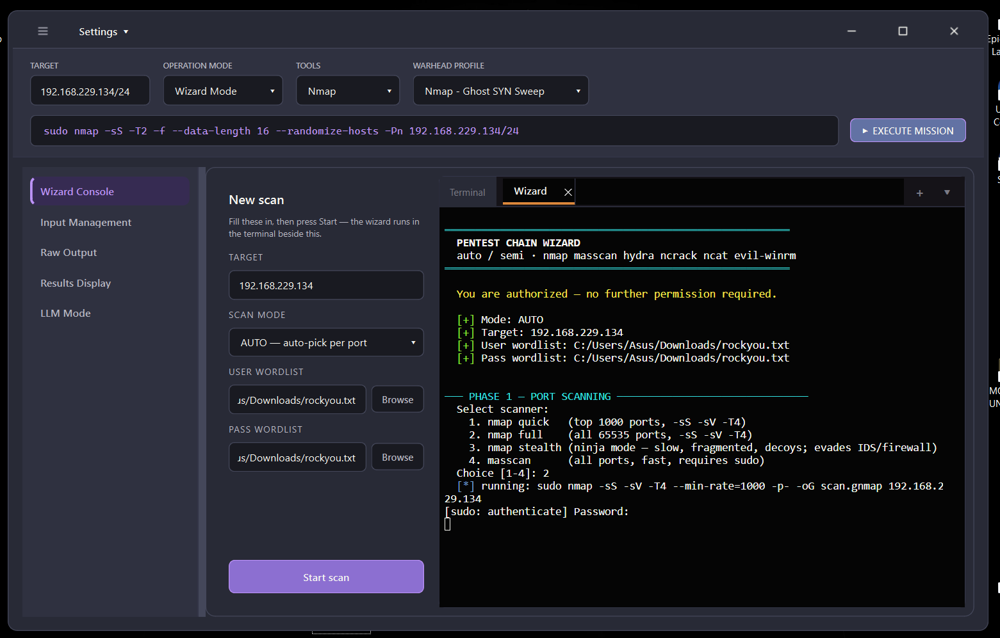
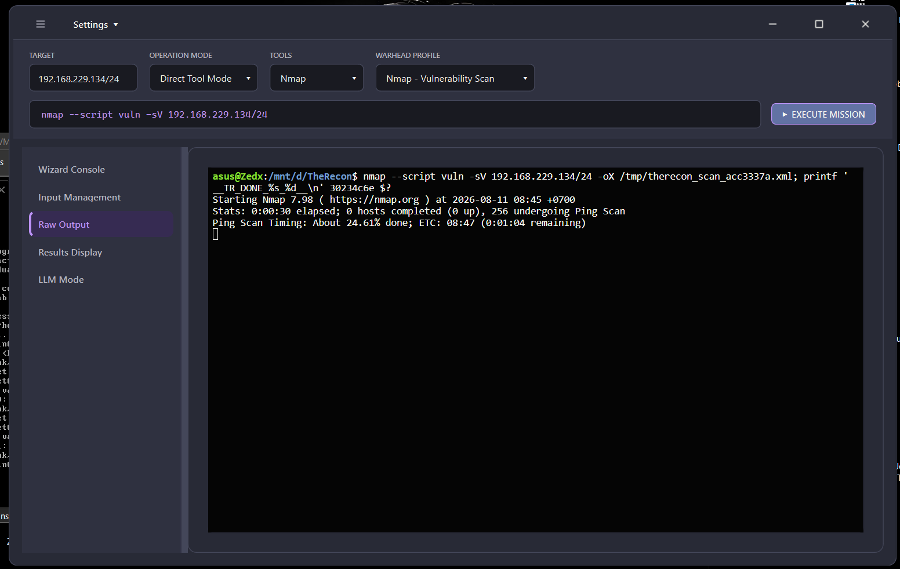
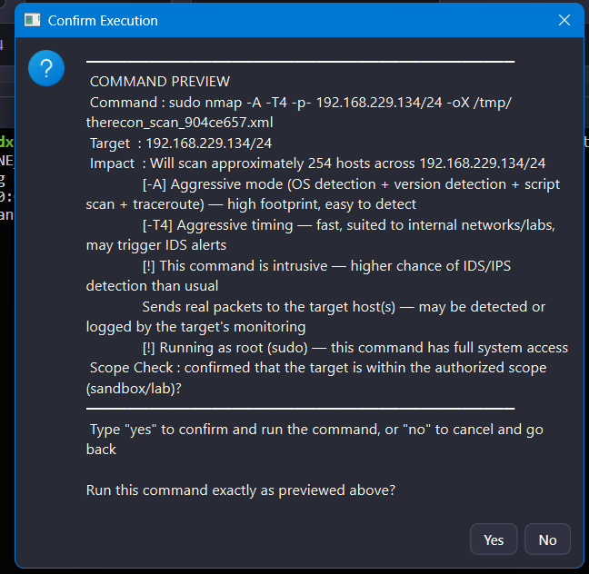
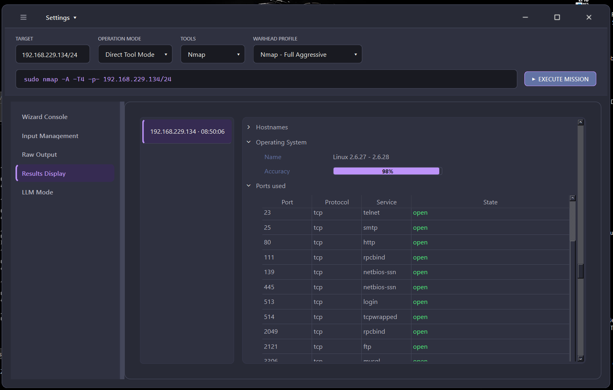
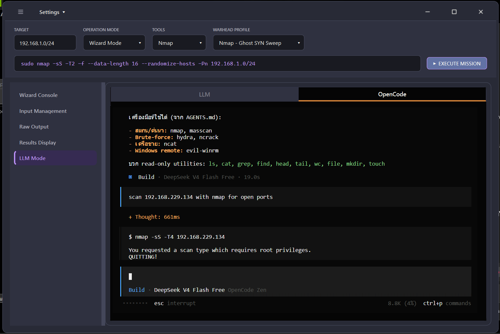
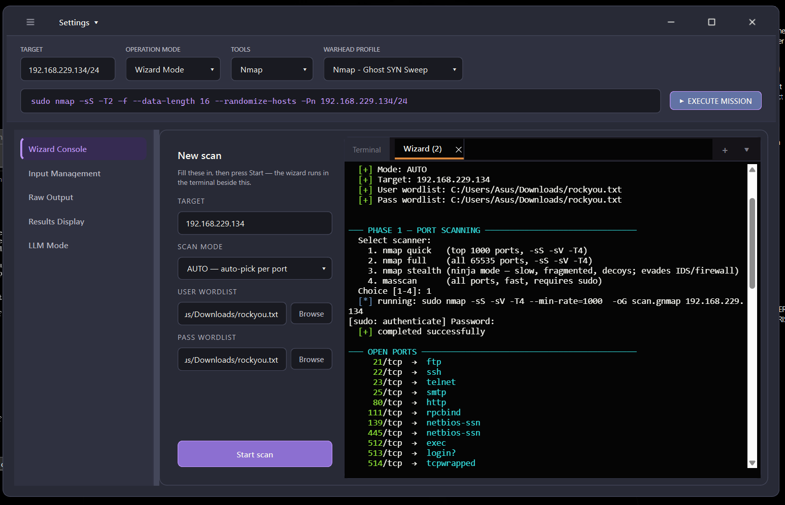
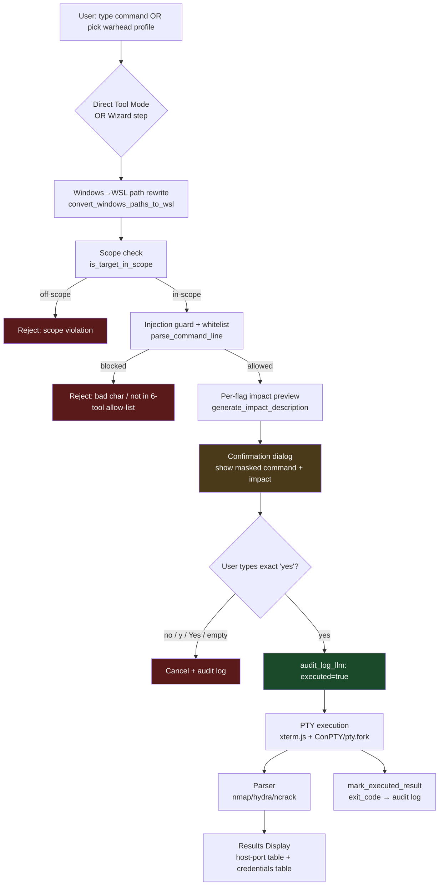

# PP-Reconnaissance-tools

> **Safety-gated GUI orchestrator for authorized network reconnaissance.**
> Solves the "one wrong flag away from scanning the wrong subnet" problem by forcing every command through validation → preview → exact-`yes` confirmation → audited execution, all behind a single desktop app.


---

## Screenshots

| Wizard Console (guided chain) | Direct Tool Mode (manual + validated) |
|---|---|
|  |  |

| Confirmation Gate (exact-`yes` required) | Parsed Results Display |
|---|---|
|  |  |

| LLM-assisted Mode (ungated by design) | Wizard Step 2 |
|---|---|
|  |  |

> Additional screenshots in [`img-gui/`](img-gui/): `input-management.png`, `setting.png`, `llm-nmap-mode.png`, `llm-agent2.png`.
> <!-- TODO: record a short GIF demo of the full Wizard chain (scan → plan → brute → post-exploit) and replace this line. -->

---

## Key Features & Security Controls

Every item below maps to code that ships in this repo — see the file reference in each bullet.

- **Whitelist enforcement (6-tool allow-list)** — `ALLOWED_PROGRAMS = {nmap, masscan, hydra, ncrack, ncat, evil-winrm}` in `src/validation/common.py`. Any other program (including `bash`, `sh`, `curl`, `python`) is rejected before execution. Bare `sudo` prefix is permitted only when the elevated program is still one of the 6.
- **Quote-aware shell-injection guard** — `_has_unquoted_shell_metachar()` scans char-by-char honoring `'...'` / `"..."` regions; blocks `; | & \` \` $ ( ) < > \` when they appear **outside** a quoted region. Lets Hydra's `http-post-form "…&pass=…"` payloads through; still rejects `foo; rm -rf /`.
- **Exact-`yes` confirmation contract** — `validate_exact_confirmation()`: only the case-sensitive literal string `"yes"` counts. `y`, `Yes`, `YES`, whitespace, empty Enter all cancel. Enforced by `ConfirmationGate.confirm()` and the wizard-step gate.
- **Single-use replay protection** — `ConfirmationGate` sets `_pending = False` after every `confirm()` (success or failure), so a stale `"yes"` cannot re-fire the same argv (`src/core/confirmation_gate.py:145`).
- **Secret masking via `argv_override`** — the preview string / audit-log entry can be a masked version (`****`) of the command while the real argv still executes. Real credentials never touch `self.command`, the preview box, or the audit log (`confirmation_gate.py:82-86`).
- **Append-only JSONL audit log with size-based rotation** — `src/report/audit_log.py` writes every gated decision (channel, command, target, response, executed, provider, exit_code) to `logs/audit_log.jsonl`. Rotates at 5 MB × 3 backups so a long-lived install can't fill the disk; history is preserved, never overwritten mid-write.
- **Scope enforcement (least-privilege target)** — `is_target_in_scope()` checks the target against `AUTHORIZED_SCOPE` (CIDR, defaults to `192.168.1.0/24`) before validation runs. Off-scope targets are rejected with `[!] Scope violation`. `skip_scope=True` exists only for local-bind operations (Ncat listen mode) that have no remote target.
- **Windows→WSL path rewrite** — `convert_windows_paths_to_wsl()` transparently rewrites `C:\wordlists\rockyou.txt` → `/mnt/c/wordlists/rockyou.txt` before validation, because commands actually execute inside WSL bash which has no drive-letter concept. Runs before the injection guard sees a bare backslash.
- **Per-flag impact preview** — `generate_impact_description(flags, target, tool)` reads `src/resources/flag_impacts.json` (all 6 tools) and produces a human-readable "this will…" block shown in the confirmation dialog. Detects bare `sudo` and appends an explicit root-privilege warning.
- **Non-repudiable channel tagging** — audit entries carry `channel` (`plain` / `ai` / `wizard`) and `provider` (`openai` / `gemini`) so an AI-suggested run is distinguishable from a human-typed one post-hoc.
- **Startup preflight doctor** — `python -m src.preflight` verifies WSL availability, all 6 tools installed, and both Python runtimes; runs at app launch with a non-blocking warning and the exact fix command.

---

## Architecture / Workflow



**Layer discipline** (from `CLAUDE.md`): GUI → Validation → Confirmation Gate → Execution → Parser → Analyzer → Results. No layer may skip another. GUI never builds commands or contains security logic.

---

## Tech Stack

| Layer | Choice | Where |
|---|---|---|
| Language | Python 3.10+ | — |
| GUI framework | PySide6 ≥ 6.6 (Qt6) | `src/ui/` |
| Terminal (primary) | xterm.js in `QWebEngineView` + real PTY | `src/ui/webterm/` |
| Terminal (fallback) | pyte VT emulator + ConPTY/pywinpty | `src/ui/pty_terminal.py` |
| Terminal (last resort) | `QProcess` pipe | `src/ui/terminal.py` |
| Execution env (Windows) | WSL2 / Ubuntu | via `wsl.exe` |
| Execution env (Linux) | native shell | — |
| Wrapped tools | Nmap · Masscan · Hydra · Ncrack · Ncat · Evil-WinRM | 6-tool whitelist |
| Test framework | pytest | `tests/` |
| Audit format | JSONL, append-only, size-rotated | `logs/audit_log.jsonl` |
| Optional LLM | `llm` CLI (OpenAI / Gemini/ Claude), OpenCode agent | LLM Mode page |

---

## How to Run / Setup

**Prerequisites**: Python 3.10+; Windows users also need WSL2 + Ubuntu (auto-installed by `install.ps1`).

### Quick install (one command)

**Linux:**
```bash
curl -fsSL https://raw.githubusercontent.com/Daimond99/PP-Reconnaissance-tools/main/install.sh | bash
```

**Windows** (run from **elevated** PowerShell the first time — WSL install needs admin + reboot):
```powershell
irm https://raw.githubusercontent.com/Daimond99/PP-Reconnaissance-tools/main/install.ps1 | iex
```

Both installers are idempotent: install the 6 tools, clone the repo, create a venv, install Python deps (`requirements.txt` → `PySide6>=6.6.0`, `pyte>=0.8.2`, `pywinpty>=2.0` on Windows).

### Manual install

```bash
# 1. Windows only: WSL2 + Ubuntu
wsl --install -d Ubuntu   # reboot if prompted, open Ubuntu once

# 2. Install the 6 tools (inside WSL Ubuntu on Windows, or native shell on Linux)
sudo apt-get update
sudo apt-get install -y nmap masscan hydra ncrack ncat ruby ruby-dev
sudo gem install evil-winrm

# 3. Clone + Python deps
git clone https://github.com/Daimond99/PP-Reconnaissance-tools.git
cd PP-Reconnaissance-tools
python -m venv .venv
# Windows (PowerShell): .venv\Scripts\Activate.ps1
# Windows (cmd.exe):    .venv\Scripts\activate.bat
# Linux/WSL/macOS:      source .venv/bin/activate
pip install -r requirements.txt

# Or without activating, call pip/python inside .venv directly:
# Windows:         .venv\Scripts\pip install -r requirements.txt
# Linux/WSL/macOS: .venv/bin/pip install -r requirements.txt

# 4. Run
python -m src.main
```

Standalone preflight check:
```bash
python -m src.preflight
```

---

## Test Coverage

```bash
python -m pytest tests/ -q
```

**53 tests** across 4 files, all covering safety-critical paths:

| File | Tests | Covers |
|---|---:|---|
| `tests/test_validation.py` | 21 | 6-tool whitelist, quote-aware injection guard, exact-`yes` rule, Windows→WSL path rewrite, `sudo` prefix handling, `shlex` parse errors |
| `tests/test_confirmation_gate.py` | 13 | Scope enforcement, preview/argv separation, single-use replay protection, secret masking via `argv_override`, audit-log side effects, cancel path |
| `tests/test_terminal_launch.py` | 12 | Cross-platform launcher script builders (WSL vs native), terminal fallback chain |
| `tests/test_gui_smoke.py` | 7 | Headless PySide6 widget construction — imports don't break, main window builds |

No external target is required — the safety layer is fully unit-testable.

---

## Repo Layout

```
src/
├── main.py                       # entry point, splash → ReconMainWindow
├── preflight.py                  # startup doctor: WSL + 6 tools + Python
├── config.py, theme.py           # constants, AUTHORIZED_SCOPE, palette
├── core/
│   ├── confirmation_gate.py      # THE gate — request/confirm/cancel + audit
│   ├── tool_manager.py           # installed-tool detection
│   └── llm_keys.py
├── validation/common.py          # whitelist + injection guard + WSL rewrite
├── tools/                        # parsers/analyzers per tool
│   ├── nmap/     (parser, analyzer)
│   ├── hydra/    (parser)
│   └── ncrack/   (parser)
├── report/audit_log.py           # append-only JSONL + rotation
├── ui/
│   ├── main_window.py, wizard_panel.py
│   ├── widgets/  (sidebar, topbar, results, raw_output, input_management)
│   ├── webterm/  (xterm.js + PTY — primary terminal)
│   ├── pty_terminal.py, terminal.py, terminal_tabs.py, terminal_launch.py
└── utils/resource_loader.py      # single JSON-loader chokepoint (cached)

chain_wizard/                     # standalone guided-chain CLI (subprocess)
tests/                            # 53 tests, safety-critical paths
docs/                             # architecture + Thai overview + change log
img-gui/                          # GUI screenshots
```

---

## Docs

- [`CLAUDE.md`](CLAUDE.md) — architecture rules, layer discipline, hard constraints
- [`docs/CURRENT_STATE.md`](docs/CURRENT_STATE.md) — file-by-file map of what's implemented
- [`docs/OVERVIEW_TH.md`](docs/OVERVIEW_TH.md) — Thai-language deep-dive
- [`docs/PROGRESS.md`](docs/PROGRESS.md) — running change log

---

## Disclaimer

**For educational use in isolated lab environments only.** TheRecon wraps offensive-security tooling (network scanners, credential brute-forcers, remote-shell clients). Running these against systems you do not own or do not have **written** authorization to test is illegal in most jurisdictions. The default `AUTHORIZED_SCOPE = 192.168.1.0/24` reflects a home-lab assumption — reconfigure or self-host in an isolated VLAN, and the authors accept no liability for misuse.
