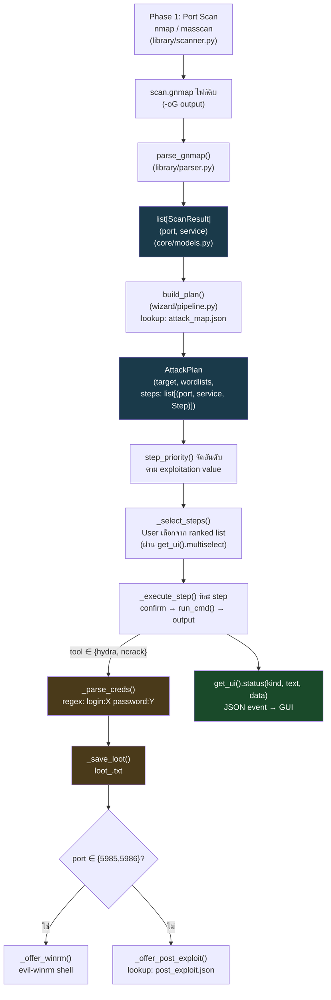

# Wizard Data Flow — จาก Recon Scan ถึง Post-Exploit พร้อม JSON Schema

เอกสารนี้อธิบาย **data flow / logic การเชื่อมข้อมูล** ภายในระบบ Wizard (`chain_wizard/`) ตั้งแต่ผลสแกน (Recon) ไปจนถึงการรัน attack step, การเก็บเกี่ยว credential, และ post-exploitation — พร้อม JSON Schema ของทุกจุดที่ข้อมูลข้ามขอบเขต (process boundary / storage) สำหรับใช้ประกอบเอกสาร defend

---

## 1. ภาพรวม Pipeline



**สรุปเป็นขั้นตอน**:

1. **Scan** (`library/scanner.py::scan_target`) — รัน nmap/masscan จริง (ผ่าน `core/executor.py::run_cmd`, ปัจจุบันรันใน Docker container) เขียนผลออกไฟล์ `.gnmap` (`-oG`)
2. **Parse** (`library/parser.py::parse_gnmap`) — อ่านไฟล์ `.gnmap` ด้วย regex ดึงเฉพาะ port ที่ `open` แปลงเป็น `list[ScanResult]`
3. **Plan** (`wizard/pipeline.py::build_plan`) — จับคู่แต่ละ `ScanResult.port` กับชุด attack step ที่ลงทะเบียนไว้ใน `attack_map.json` สร้าง `AttackPlan`
4. **Rank & Select** (`wizard/chain.py::step_priority`, `_select_steps`) — จัดอันดับตาม exploitation value (5=RCE/shell ตรง, 4=brute-force service สำคัญ, 3=brute-force อื่น/vuln scan, 2=enumeration) ให้ผู้ใช้เลือกผ่าน multiselect
5. **Execute** (`_execute_step`) — confirm impact ทีละ step → `run_cmd()` (ใน container) → ได้ output ดิบ
6. **Harvest** — ถ้า step เป็น hydra/ncrack, regex ดึง `(user, password)` จาก output, บันทึกลง loot file
7. **Chain ต่อ (Post-Exploit)** — ถ้า credential มาจาก port WinRM (5985/5986) เปิด evil-winrm shell ทันที; ถ้าไม่ใช่ ค้นหา action ที่แมปไว้ใน `post_exploit.json` ตาม service/port
8. **Status → GUI** — ทุกจุดสำคัญของ pipeline ส่ง JSON event ผ่าน `get_ui().status(kind, text, data)` กลับไปที่ GUI (เมื่อรันในโหมด `--gui`) แบบ real-time

---

## 2. Internal Data Models (`chain_wizard/core/models.py`)

โครงสร้างข้อมูลหลักที่ไหลผ่านทุกขั้นตอน (Python dataclass — ไม่ได้ serialize เป็น JSON โดยตรง แต่เป็นต้นทางของทุก schema ด้านล่าง):

```python
@dataclass(frozen=True)
class ScanResult:
    port: int
    service: str            # อาจว่าง ถ้า nmap/masscan ไม่รู้จัก service

@dataclass(frozen=True)
class Step:
    name: str
    tool: str                # หนึ่งใน 6 เครื่องมือที่ได้รับอนุญาต
    command_template: str    # เช่น "hydra -L {userlist} -P {passlist} ... {target}"
    impact: str
    is_recommended: bool = False

@dataclass
class AttackPlan:
    target: str
    user_wordlist: str
    pass_wordlist: str
    steps: list[tuple[int, str, Step]]   # (port, service, Step)
    logfile: str
```

---

## 3. JSON Schema แต่ละจุดที่ข้อมูลข้ามขอบเขต

### 3.1 Input ดิบ: `.gnmap` (nmap/masscan `-oG` output)

ไม่ใช่ JSON — เป็น text format ของ nmap เอง, parse ด้วย regex `(\d+)/(open)/tcp//([^/]*)` ที่ `library/parser.py`:

```
Host: 192.168.1.10 ()  Ports: 22/open/tcp//ssh//OpenSSH 8.9//, 80/open/tcp//http//Apache 2.4//
```

→ แปลงเป็น `list[ScanResult]` (ดูข้อ 2)

### 3.2 `attack_map.json` — Arsenal ต่อพอร์ต (`chain_wizard/library/attack_map.json`)

```json
{
  "$schema": "http://json-schema.org/draft-07/schema#",
  "title": "AttackMap",
  "type": "object",
  "description": "คีย์คือหมายเลขพอร์ตแบบ string, ค่าเป็น array ของ Step ที่ลงทะเบียนไว้สำหรับพอร์ตนั้น",
  "patternProperties": {
    "^[0-9]+$": {
      "type": "array",
      "items": {
        "type": "object",
        "required": ["name", "tool", "command_template", "impact"],
        "properties": {
          "name": { "type": "string", "description": "ชื่อ step แสดงใน UI" },
          "tool": {
            "type": "string",
            "enum": ["nmap", "masscan", "hydra", "ncrack", "ncat", "evil-winrm"],
            "description": "ต้องอยู่ใน whitelist 6 เครื่องมือเท่านั้น"
          },
          "command_template": {
            "type": "string",
            "description": "คำสั่งดิบ ใช้ {target}/{userlist}/{passlist} เป็น placeholder แทนที่ตอนรันจริง"
          },
          "impact": { "type": "string", "description": "คำเตือนผลกระทบ แสดงในกล่อง confirm" },
          "is_recommended": { "type": "boolean", "default": false }
        }
      }
    }
  }
}
```

ตัวอย่างจริง (พอร์ต 22):
```json
{
  "22": [
    {
      "name": "SSH brute-force (hydra) — recommended",
      "tool": "hydra",
      "command_template": "hydra -L {userlist} -P {passlist} -t 4 -o hydra_ssh.txt ssh://{target} -V",
      "impact": "SSH server logs every attempt; Fail2Ban / DenyHosts may block your IP.",
      "is_recommended": true
    }
  ]
}
```

### 3.3 `post_exploit.json` — Action หลัง Credential (`chain_wizard/library/post_exploit.json`)

```json
{
  "$schema": "http://json-schema.org/draft-07/schema#",
  "title": "PostExploitMap",
  "type": "object",
  "description": "คีย์คือ service name (จาก nmap) หรือ port number แบบ string เป็น fallback",
  "additionalProperties": {
    "type": "object",
    "required": ["command_template"],
    "properties": {
      "desc": { "type": "string" },
      "tool": {
        "type": "string",
        "enum": ["nmap", "masscan", "hydra", "ncrack", "ncat", "evil-winrm"]
      },
      "command_template": {
        "type": "string",
        "description": "ใช้ {target}/{user}/{password} เป็น placeholder"
      },
      "impact": { "type": "string" }
    }
  }
}
```

### 3.4 IPC Protocol — GUI ↔ `chain_wizard` subprocess (JSON-lines ผ่าน stdout/stdin)

ทั้งสองฝั่งคุยกันผ่าน `chain_wizard/core/ui_driver.py::IpcUI` (ฝั่ง wizard) และ `src/core/wizard_driver.py` (ฝั่ง GUI) — **หนึ่งบรรทัด = หนึ่ง JSON object** โดย wizard เป็นฝ่ายเขียนก่อนเสมอ (request) แล้วบล็อกรอ GUI ตอบกลับหนึ่งบรรทัด (reply)

#### 3.4.1 Request จาก wizard → GUI

```json
{
  "$schema": "http://json-schema.org/draft-07/schema#",
  "title": "WizardRequest",
  "type": "object",
  "required": ["type"],
  "oneOf": [
    {
      "properties": {
        "type": { "const": "menu" },
        "title": { "type": "string" },
        "options": { "type": "array", "items": { "type": "string" } },
        "default": { "type": "string" }
      },
      "required": ["type", "title", "options"]
    },
    {
      "properties": {
        "type": { "const": "text" },
        "prompt": { "type": "string" },
        "default": { "type": "string" }
      },
      "required": ["type", "prompt"]
    },
    {
      "properties": {
        "type": { "const": "multiselect" },
        "title": { "type": "string" },
        "items": {
          "type": "array",
          "items": {
            "type": "object",
            "properties": {
              "port": { "type": "integer" },
              "service": { "type": "string" },
              "tool": { "type": "string" },
              "name": { "type": "string" },
              "priority": { "type": "integer", "minimum": 2, "maximum": 5 }
            }
          }
        }
      },
      "required": ["type", "title", "items"]
    },
    {
      "properties": {
        "type": { "const": "confirm" },
        "title": { "type": "string" },
        "cmd": { "type": "string", "description": "คำสั่งดิบที่จะรันถ้าถูก confirm" },
        "impact": { "type": "string" }
      },
      "required": ["type", "cmd", "impact"]
    },
    {
      "properties": {
        "type": { "const": "status" },
        "kind": {
          "type": "string",
          "enum": ["scan_result", "step_start", "step_done", "cred_found", "summary"]
        },
        "text": { "type": "string" },
        "data": { "type": "object" }
      },
      "required": ["type", "kind", "text", "data"],
      "description": "ทางเดียว (one-way) — ไม่ต้องตอบกลับ, ดูรายละเอียด data ตาม kind ที่ 3.4.3"
    },
    {
      "properties": { "type": { "const": "sudo_password" } },
      "required": ["type"],
      "deprecated": true,
      "description": "เดิมใช้ขอ sudo password ผ่าน GUI dialog เพื่อ prime sudo บน WSL host — ไม่ถูกส่งอีกต่อไปหลังย้ายเครื่องมือเข้า Docker container (sudo จัดการภายใน container เอง แบบ NOPASSWD scoped) โค้ดฝั่งรับยังไม่ถูกลบ (dead code)"
    }
  ]
}
```

#### 3.4.2 Reply จาก GUI → wizard (สำหรับ request ที่ต้องการคำตอบ)

```json
{
  "$schema": "http://json-schema.org/draft-07/schema#",
  "title": "GuiReply",
  "type": "object",
  "properties": {
    "reply": {
      "oneOf": [
        { "type": "string", "description": "menu / text / multiselect" },
        { "type": "boolean", "description": "confirm" }
      ]
    }
  },
  "required": ["reply"]
}
```

`confirm` เพิ่มเติมฝั่ง GUI ก่อนส่งกลับ — ไม่ได้เป็นส่วนของ IPC message แต่เป็น local field ที่ `src/core/wizard_driver.py` เติมเข้าไปก่อนส่งให้ dialog แสดงผล (ผ่าน `ConfirmationGate.request()` เดียวกับ Direct Tool Mode):
```json
{
  "type": "confirm", "title": "...", "cmd": "...", "impact": "...",
  "preview_box": "กล่องข้อความ preview เต็มรูปแบบที่ ConfirmationGate สร้าง",
  "allowed": true,
  "reject_reason": null
}
```

#### 3.4.3 `status` message — `data` schema แยกตาม `kind`

| kind | data schema | เกิดขึ้นตอนไหน |
|---|---|---|
| `scan_result` | `{"port": int, "service": string}` | ทุกพอร์ตที่เปิดเจอหลัง scan (`wizard/chain.py::run_chain`) |
| `step_start` | `{"port": int, "service": string, "tool": string, "name": string}` | ก่อนรัน step จริง (ก่อน `run_cmd`) |
| `step_done` | `{"port": int, "service": string, "tool": string, "name": string, "outcome": "done"\|"skipped"}` | หลัง step จบ (ไม่ใช่ credential-yielding step) |
| `cred_found` | `{"port": int, "service": string, "user": string, "password": string}` | ทันทีที่ `_parse_creds()` เจอ credential คู่ใหม่ |
| `summary` | `{"executed": int, "skipped": int, "creds_found": [string], "logfile": string}` | จบทั้ง chain |

### 3.5 Loot file (`loot_<target>.txt`) — ผลลัพธ์สุดท้ายที่เก็บถาวร

ไม่ใช่ JSON — text แบบ tab-separated, append-only (`wizard/chain.py::_save_loot`):
```
<target>\t<port>/<service>\t<user>:<password>
```
ตัวอย่าง: `192.168.1.10\t22/ssh\tadmin:hunter2`

---

## 4. สรุปเส้นทางข้อมูลแบบ end-to-end

```
nmap/masscan (Docker container) 
    → scan.gnmap (text, ephemeral, ลบทิ้งหลัง parse)
    → list[ScanResult] (Python object ในหน่วยความจำ)
    → AttackPlan (จับคู่กับ attack_map.json)
    → ranked steps (step_priority) → user เลือก (multiselect JSON ↔ GUI)
    → run_cmd() ในแต่ละ step (Docker container)
    → regex parse credential จาก output ดิบ
    → loot_<target>.txt (persist ถาวรบน host, tab-separated)
    → post_exploit.json lookup → เปิด evil-winrm หรือ post-exploit step ต่อ
    → ทุกจุดสำคัญ echo เป็น JSON "status" event กลับ GUI แบบ real-time
    → audit_log.jsonl (ทุก confirm ผ่าน ConfirmationGate เดียวกับ Direct Tool Mode)
```

**จุดสำคัญที่ควรเน้นตอน defend**: ข้อมูลที่ "อันตราย" ที่สุดในเส้นทางนี้ (credential ที่ harvest ได้) ไม่เคยถูกส่งผ่าน JSON IPC ไปที่ GUI process ในรูปแบบดิบที่ persist ถาวรฝั่ง GUI เลย — มันถูกใช้ต่อทันทีภายใน chain_wizard subprocess เอง (offer evil-winrm/post-exploit) และ log ไว้ที่ loot file บน disk เท่านั้น; สิ่งที่ GUI process เห็นคือแค่ `cred_found` status event (สำหรับแสดงผลใน Results Display) ไม่ใช่ตัวควบคุมการไหลของ credential จริง
